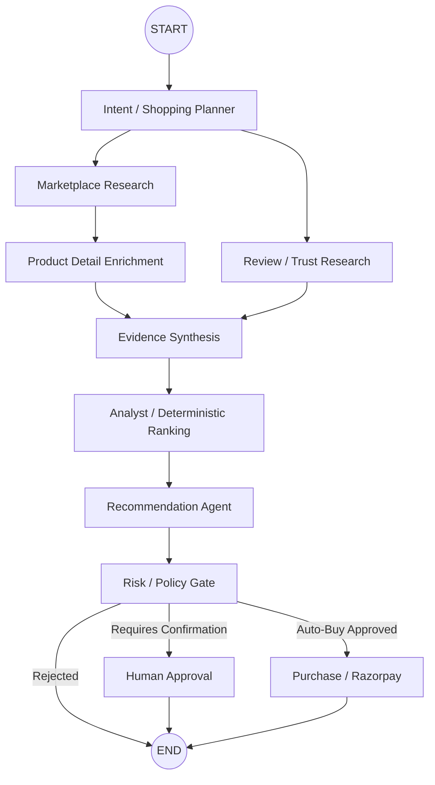

# shop.ai — Multi-Agent Autonomous Commerce System

**shop.ai** is an advanced, multi-agent autonomous shopping system built with **LangGraph**. It acts as a category-agnostic personal shopper that translates natural-language goals into structured intent, scours live marketplaces via SerpAPI, enriches product evidence, deterministically ranks options based on utility math, and seamlessly executes secure, idempotent purchases via Razorpay.

Unlike typical chatbots that summarize search results, shop.ai employs a **multi-stage analytical pipeline** with dedicated agents for intent planning, risk gating, deterministic ranking, and human-in-the-loop purchase approvals.

---

## 🚀 Live Demo & Deployment

- **Frontend Application**: Deployed on Vercel at [https://shop-ai-beta.vercel.app/](https://shop-ai-beta.vercel.app/)
- **Backend API**: Deployed on Render using Docker & FastAPI.
- **Continuous Integration**: Managed via GitHub Actions with automatic Docker builds and deployments.

---

## Key Features

- **Multi-Agent Architecture (LangGraph)**: Stateful orchestration across 8 specialized nodes (Intent, Marketplace, Enrichment, Review, Evidence, Analyst, Recommendation, Risk, Purchase).
- **Resilient Multi-Provider Fallback**: Robust LLM failover. If the primary provider (Gemini) hits rate limits or errors, the system automatically falls back to Groq for structured JSON generation, ensuring zero data loss and strict intent preservation.
- **Evidence-Grounded Spec Matching**: Uses SerpAPI's Google Immersive Product API to retrieve deep attributes, matching them against explicit user requirements without hallucinating unstated features.
- **Deterministic Product Ranking**: A predictable, mathematical ranking engine utilizing Bayesian quality scores and 4-component utility math (Quality, Price Value, Feature Match, Availability) rather than leaving ranking to opaque LLM generation.
- **Secure Purchases**: Cryptographically verified Razorpay payment integration with idempotent checkout sessions, risk gating, and Human-in-the-Loop (HITL) approval flows.
- **Deep Observability**: Fully integrated with LangSmith for precise step-level tracing and evaluation.

---

## System Architecture

The core of shop.ai is a state machine built with LangGraph. 



### Multi-Agent Components

1. **Intent Extraction & Provider Fallback (`intent_node`)**
   - Parses the natural language `user_goal` into a structured, category-agnostic JSON schema (budget, use case, hard constraints, soft preferences, priorities).
   - *Architecture Note:* Implements a strict failover from **Gemini → Groq → Explicit Failure**. The Groq fallback receives the full original `user_goal` to ensure explicit requirements (like 16GB RAM, OIS) are preserved, completely replacing older brittle regex heuristics.
   
2. **Marketplace Discovery (`marketplace_research_node`)**
   - Generates natural, retrieval-friendly search queries (e.g., `laptop 16GB RAM 512GB SSD under 70000`).
   - Queries live Google Shopping data via SerpAPI to collect broad candidate lists.

3. **Product Detail Enrichment (`product_info_research_node`)**
   - Extracts the `immersive_product_page_token` from broad search results and queries the SerpAPI Immersive Product API for deep technical specifications, avoiding hallucinations.

4. **Review & Trust Research (`review_trust_research_node`)**
   - Establishes category-level baselines for Bayesian rating calculations and merchant trust signals.

5. **Evidence Synthesis (`evidence_synthesis_node`)**
   - Evaluates the deep product specifications against the structured user intent, creating a three-state matching matrix for every product (`matched_requirements`, `missing_requirements`, `unknown_requirements`).

6. **Deterministic Analyst (`analyst_node`)**
   - Scores candidates using a 4-component utility equation rather than asking an LLM to rank them.
   - Calculates Bayesian average quality, applies dynamically calculated priority weights, and yields a ranked list.

7. **Recommendation Engine (`recommendation_node`)**
   - Synthesizes the deterministic evidence into an explainable "Why This Product?" summary, explicitly addressing trade-offs.

8. **Risk & Purchase Flow (`risk_node`, `approval_node`, `purchase_node`)**
   - Gates the purchase based on safety policies.
   - Generates idempotent Razorpay orders, securely verifying HMAC-SHA256 signatures upon payment completion.

---

## Evaluation Methodology

The system's end-to-end performance is evaluated using an LLM-as-a-judge framework, ensuring rigorous assessment against the **original user request**, not just the search results.

**The Evaluator Schema:**
The judge assesses the complete state—`user_goal`, `requirements`, `selected_product`, `candidates`, `evidence`, and `final_response`—across 8 strict dimensions on a 0–100 scale:

1. **Goal Achievement**: Did it find the right category and price?
2. **Requirement Adherence**: Were hard constraints and soft preferences strictly obeyed?
3. **Recommendation Quality**: How well does the product match the user's priorities?
4. **Evidence Grounding**: Are claims supported by actual scraped evidence?
5. **Reasoning and Synthesis**: Is the internal justification sound?
6. **Safety and Purchase Correctness**: Is the checkout gated appropriately?
7. **Usefulness and Actionability**: How helpful is the final response?
8. **Overall Quality**: The holistic score for the shopping experience.

### Evaluation Results (5 Diverse Categories)

| Category | Goal Achievement | Requirement Adherence | Recommendation Quality | Evidence Grounding | Reasoning & Synthesis | Safety / Purchase | Usefulness | Overall Quality |
| :--- | :--- | :--- | :--- | :--- | :--- | :--- | :--- | :--- |
| **Laptop** | 100 | 100 | 95 | 100 | 95 | 100 | 90 | **95.0** |
| **Earbuds** | 100 | 100 | 100 | 95 | 95 | 100 | 80 | **92.0** |
| **Monitor** | 85 | 75 | 85 | 100 | 80 | 100 | 85 | **82.0** |
| **Smartphone** | 100 | 100 | 100 | 100 | 95 | 100 | 100 | **98.0** |
| **Running Shoes**| 85 | 95 | 65 | 100 | 60 | 100 | 50 | **68.0** |
| *AVERAGE* | *94.0* | *94.0* | *89.0* | *99.0* | *85.0* | *100.0* | *81.0* | *87.0* |

*(Note: These are qualitative evaluator ratings out of 100, not classification accuracy percentages).*

#### Strengths Identified
- **Evidence-Grounded Recommendations (Avg 99)**: The system excels at ensuring that recommendations are strictly supported by retrieved evidence without hallucinating features.
- **Explicit Requirement Satisfaction (Avg 94)**: Extremely reliable at extracting and adhering to the user's hard constraints and budgets.
- **Safe Purchase Gating (Avg 100)**: Consistently blocks unsafe automated purchases and correctly routes to human approval.

#### Known Limitations
- **Qualitative Verification**: Struggles to verify qualitative constraints (e.g., "good cushioning", "adjustable stand") when the raw data source lacks explicit technical fields for them.
- **Brief Final Responses**: While internal reasoning is strong, the final user-facing recommendation message is sometimes overly minimalist and fails to fully explain *why* the product meets the unverified requirements.
- **Metadata Inconsistencies**: Minor discrepancies occur occasionally (e.g., labeling battery life as 'unknown' internally despite it existing in the specs).

---

## Tech Stack

- **Orchestration**: LangGraph, LangChain
- **LLM Engine**: Google Gemini (Primary), Groq (Failover)
- **Marketplace Data**: SerpAPI (Google Shopping & Immersive Product API)
- **Backend Framework**: Python, FastAPI
- **Frontend Framework**: React / Vite / Tailwind
- **Deployment & Hosting**: Docker, Vercel, Render
- **Payments**: Razorpay SDK
- **Database**: SQLite, SQLAlchemy
- **Observability**: LangSmith

---

## Project Structure

```text
shop.ai/
├── app/
│   ├── agents/          # LangGraph nodes and orchestrator (Intent, Research, Risk, etc.)
│   ├── api/             # FastAPI entrypoints
│   ├── commerce/        # Deterministic ranking and utility math
│   ├── integrations/    # External clients (SerpAPI, Merchant systems)
│   ├── inventory/       # Stock and reservation logic
│   ├── mcp/             # MCP Servers
│   ├── observability/   # SQLite logging
│   └── payments/        # Razorpay integration and HMAC validation
├── database/            # SQLAlchemy models
├── frontend/            # React/Vite UI
├── scripts/             # End-to-end evaluation benchmark scripts
├── tests/               # Unit and pipeline tests
├── Dockerfile           # Backend Docker configuration
└── start.sh             # Launch script
```

---

## Setup & Running Locally

1. **Environment Variables**:
   Copy `.env.example` to `.env` and populate:
   ```env
   # API Keys
   GEMINI_API_KEY=your_gemini_key
   GROQ_API_KEY=your_groq_key
   SERPAPI_API_KEY=your_serpapi_key
   
   # Razorpay Credentials
   RAZORPAY_KEY_ID=your_key_id
   RAZORPAY_KEY_SECRET=your_key_secret
   
   # Observability (Optional)
   LANGSMITH_TRACING=true
   LANGCHAIN_API_KEY=your_langsmith_key
   ```

2. **Install Dependencies**:
   ```bash
   pip install -r requirements.txt
   ```

3. **Run the Backend**:
   ```bash
   uvicorn app.api.main:app --reload
   ```

4. **Run Tests and Evaluations**:
   ```bash
   python tests/test_pipeline.py
   python scripts/evaluate_system.py
   ```

---

## Deployment Instructions

### Deploying the Backend (Render via Docker)
The backend is fully containerized. To deploy to Render or any Docker-compatible hosting:
1. Connect the repository to your Render dashboard.
2. Select **Docker** as the deployment environment.
3. Ensure the environment variables (`GEMINI_API_KEY`, `RAZORPAY_KEY_ID`, etc.) are securely added to the Render environment settings.

### Deploying the Frontend (Vercel)
1. Import the repository into Vercel.
2. Set the **Root Directory** to `frontend/`.
3. Vercel will automatically detect the React/Vite build settings (`npm run build`).
4. Set the `VITE_API_BASE_URL` environment variable to point to your deployed Render backend URL.
